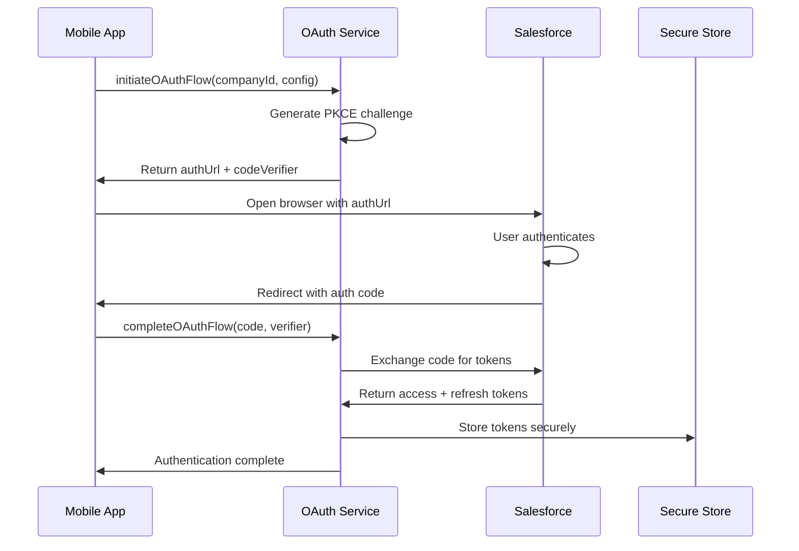
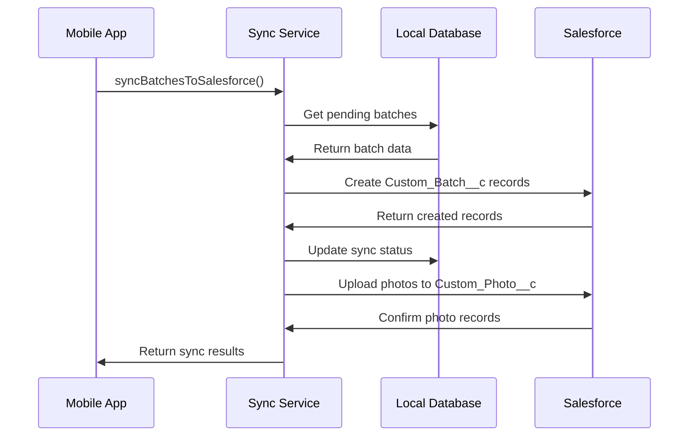

# Salesforce OAuth Integration - Technical Implementation Guide

## Architecture Overview

The Aviation Quality Control App implements a secure, company-level Salesforce OAuth integration with the following key components:

### Core Services

1. **salesforceOAuthService.ts** - Handles OAuth 2.0 flow and token management
2. **salesforceSyncService.ts** - Manages data synchronization between app and Salesforce
3. **salesforceIntegrationService.ts** - High-level orchestration and business logic
4. **companyIntegrationsService.ts** - Company-level configuration management

### Key Features

- **Company-Level OAuth**: Single configuration per company, shared by all users
- **PKCE Security**: Proof Key for Code Exchange for enhanced mobile security
- **Secure Token Storage**: OAuth tokens stored with Expo SecureStore
- **Multi-Tenant Support**: Complete data isolation between companies
- **Offline-First**: Queue operations when offline, sync when connected
- **Custom Objects**: Uses Custom_Batch__c and Custom_Photo__c in Salesforce

## Service Architecture

### 1. SalesforceOAuthService

**Purpose**: Manages OAuth 2.0 authentication flow and token lifecycle

**Key Methods**:
```typescript
// Initiate OAuth flow
async initiateOAuthFlow(companyId: string, config: SalesforceOAuthConfig): Promise<{authUrl: string, codeChallenge: string}>

// Complete OAuth flow after user authorization
async completeOAuthFlow(companyId: string, authCode: string, codeVerifier: string, config: SalesforceOAuthConfig): Promise<SalesforceTokens>

// Refresh expired access tokens
async refreshTokens(companyId: string): Promise<SalesforceTokens>

// Validate current tokens
async validateTokens(companyId: string): Promise<boolean>

// Revoke tokens (logout)
async revokeTokens(companyId: string): Promise<void>
```

**Security Features**:
- PKCE (Proof Key for Code Exchange) implementation
- Secure token storage with Expo SecureStore
- Automatic token refresh before expiration
- Company-isolated token storage

### 2. SalesforceSyncService

**Purpose**: Handles bidirectional data synchronization

**Key Methods**:
```typescript
// Sync photo batches to Salesforce
async syncBatchesToSalesforce(companyId: string, batches: PhotoBatch[]): Promise<SyncResult>

// Sync individual photos to Salesforce
async syncPhotosToSalesforce(companyId: string, photos: PhotoData[]): Promise<SyncResult>

// Pull updates from Salesforce
async pullUpdatesFromSalesforce(companyId: string): Promise<SyncResult>

// Get sync status and statistics
async getSyncStatus(companyId: string): Promise<SyncStatus>
```

**Sync Features**:
- Batch and incremental sync modes
- Conflict resolution strategies
- Retry logic with exponential backoff
- Detailed sync logging and error reporting

### 3. SalesforceIntegrationService

**Purpose**: High-level orchestration and business logic

**Key Methods**:
```typescript
// Initialize integration for a company
async initializeIntegration(companyId: string, config: SalesforceOAuthConfig): Promise<void>

// Perform full sync operation
async performFullSync(companyId: string): Promise<SyncResult>

// Get integration status
async getIntegrationStatus(companyId: string): Promise<IntegrationStatus>

// Handle integration errors
async handleIntegrationError(companyId: string, error: Error): Promise<void>
```

## Data Flow

### OAuth Authentication Flow



### Data Sync Flow



## Configuration Schema

### SalesforceOAuthConfig

```typescript
interface SalesforceOAuthConfig {
  clientId: string;           // Consumer Key from Connected App
  clientSecret: string;       // Consumer Secret from Connected App
  redirectUri: string;        // OAuth callback URL
  instanceUrl?: string;       // Salesforce instance URL
  sandbox: boolean;           // Use sandbox environment
  scopes: string[];          // OAuth scopes
}
```

### Field Mapping Configuration

```typescript
interface FieldMapping {
  batchMapping: {
    [appField: string]: string;  // App field -> Salesforce field
  };
  photoMapping: {
    [appField: string]: string;  // App field -> Salesforce field
  };
}

// Default mapping
const DEFAULT_FIELD_MAPPING: FieldMapping = {
  batchMapping: {
    'referenceId': 'Reference_ID__c',
    'orderNumber': 'Order_Number__c',
    'inventoryId': 'Inventory_ID__c',
    'status': 'Status__c',
    'photoCount': 'Photo_Count__c',
    'userId': 'Created_By_User__c',
    'companyId': 'Company_ID__c'
  },
  photoMapping: {
    'photoTitle': 'Photo_Title__c',
    'partNumber': 'Part_Number__c',
    'photoType': 'Photo_Type__c',
    'fileUrl': 'File_URL__c',
    'metadata': 'Metadata_JSON__c',
    'location': 'Location_Data__c',
    'timestamp': 'Timestamp__c',
    'companyId': 'Company_ID__c'
  }
};
```

## Error Handling

### Error Types

```typescript
enum SalesforceErrorType {
  AUTHENTICATION_ERROR = 'AUTHENTICATION_ERROR',
  AUTHORIZATION_ERROR = 'AUTHORIZATION_ERROR',
  NETWORK_ERROR = 'NETWORK_ERROR',
  API_LIMIT_ERROR = 'API_LIMIT_ERROR',
  DATA_VALIDATION_ERROR = 'DATA_VALIDATION_ERROR',
  SYNC_CONFLICT_ERROR = 'SYNC_CONFLICT_ERROR',
  CONFIGURATION_ERROR = 'CONFIGURATION_ERROR'
}

class SalesforceIntegrationError extends Error {
  constructor(
    public type: SalesforceErrorType,
    public message: string,
    public details?: any,
    public retryable: boolean = false
  ) {
    super(message);
  }
}
```

### Error Recovery Strategies

1. **Authentication Errors**
   - Attempt token refresh
   - If refresh fails, prompt for re-authentication
   - Clear invalid tokens

2. **Network Errors**
   - Queue operations for retry
   - Implement exponential backoff
   - Notify user of offline status

3. **API Limit Errors**
   - Implement rate limiting
   - Queue operations for later
   - Notify admin of limit issues

4. **Data Validation Errors**
   - Log detailed error information
   - Skip invalid records
   - Notify user of data issues

## Security Implementation

### Token Security

```typescript
// Secure token storage
const TOKEN_STORAGE_KEY = (companyId: string) => `salesforce_tokens_${companyId}`;

async storeTokens(companyId: string, tokens: SalesforceTokens): Promise<void> {
  const key = TOKEN_STORAGE_KEY(companyId);
  const encryptedTokens = JSON.stringify(tokens);
  await SecureStore.setItemAsync(key, encryptedTokens);
}

async getTokens(companyId: string): Promise<SalesforceTokens | null> {
  const key = TOKEN_STORAGE_KEY(companyId);
  const encryptedTokens = await SecureStore.getItemAsync(key);
  return encryptedTokens ? JSON.parse(encryptedTokens) : null;
}
```

### PKCE Implementation

```typescript
// Generate PKCE challenge for OAuth flow
const generatePKCEChallenge = (): PKCEChallenge => {
  const codeVerifier = AuthSession.AuthRequest.createRandomCodeChallenge();
  return {
    codeVerifier: codeVerifier.codeVerifier,
    codeChallenge: codeVerifier.codeChallenge,
    codeChallengeMethod: 'S256'
  };
};
```

### Multi-Tenant Data Isolation

```typescript
// Ensure all Salesforce operations include company context
const addCompanyContext = (data: any, companyId: string): any => {
  return {
    ...data,
    Company_ID__c: companyId
  };
};

// Filter data by company in queries
const buildCompanyQuery = (companyId: string, additionalFilters?: string): string => {
  const baseFilter = `Company_ID__c = '${companyId}'`;
  return additionalFilters ? `${baseFilter} AND ${additionalFilters}` : baseFilter;
};
```

## Performance Optimization

### Batch Operations

```typescript
// Process records in batches to avoid API limits
const BATCH_SIZE = 200; // Salesforce bulk API limit

async syncBatchesInChunks(batches: PhotoBatch[]): Promise<SyncResult[]> {
  const chunks = chunkArray(batches, BATCH_SIZE);
  const results: SyncResult[] = [];
  
  for (const chunk of chunks) {
    try {
      const result = await this.syncBatchChunk(chunk);
      results.push(result);
      
      // Rate limiting - wait between batches
      await new Promise(resolve => setTimeout(resolve, 1000));
    } catch (error) {
      console.error('Batch sync error:', error);
      results.push({ success: false, error: error.message });
    }
  }
  
  return results;
}
```

### Caching Strategy

```typescript
// Cache frequently accessed data
interface SalesforceCache {
  objectMetadata: Map<string, ObjectMetadata>;
  fieldMappings: Map<string, FieldMapping>;
  lastSyncTimestamp: Map<string, Date>;
}

class SalesforceCacheManager {
  private cache: SalesforceCache = {
    objectMetadata: new Map(),
    fieldMappings: new Map(),
    lastSyncTimestamp: new Map()
  };
  
  async getObjectMetadata(objectName: string): Promise<ObjectMetadata> {
    if (!this.cache.objectMetadata.has(objectName)) {
      const metadata = await this.fetchObjectMetadata(objectName);
      this.cache.objectMetadata.set(objectName, metadata);
    }
    return this.cache.objectMetadata.get(objectName)!;
  }
}
```

## Testing Strategy

### Unit Tests

```typescript
// Test OAuth flow
describe('SalesforceOAuthService', () => {
  it('should generate valid PKCE challenge', () => {
    const challenge = generatePKCEChallenge();
    expect(challenge.codeVerifier).toBeDefined();
    expect(challenge.codeChallenge).toBeDefined();
    expect(challenge.codeChallengeMethod).toBe('S256');
  });
  
  it('should handle token refresh', async () => {
    const mockTokens = { access_token: 'new_token', refresh_token: 'refresh' };
    mockFetch.mockResolvedValueOnce({
      ok: true,
      json: () => Promise.resolve(mockTokens)
    });
    
    const result = await oauthService.refreshTokens('company123');
    expect(result).toEqual(mockTokens);
  });
});
```

### Integration Tests

```typescript
// Test end-to-end sync flow
describe('Salesforce Integration E2E', () => {
  it('should sync batch data to Salesforce', async () => {
    // Setup test data
    const testBatch = createTestBatch();
    
    // Perform sync
    const result = await integrationService.syncBatchesToSalesforce('company123', [testBatch]);
    
    // Verify results
    expect(result.success).toBe(true);
    expect(result.syncedCount).toBe(1);
    
    // Verify in Salesforce (mock or sandbox)
    const salesforceRecord = await querySalesforceRecord(testBatch.referenceId);
    expect(salesforceRecord).toBeDefined();
  });
});
```

## Monitoring and Logging

### Comprehensive Logging

```typescript
class SalesforceLogger {
  static logOAuthFlow(companyId: string, step: string, details?: any): void {
    console.log(`[SalesforceOAuth][${companyId}] ${step}`, details);
  }
  
  static logSyncOperation(companyId: string, operation: string, result: SyncResult): void {
    console.log(`[SalesforceSync][${companyId}] ${operation}:`, {
      success: result.success,
      recordCount: result.syncedCount,
      errors: result.errors?.length || 0
    });
  }
  
  static logError(companyId: string, error: SalesforceIntegrationError): void {
    console.error(`[SalesforceError][${companyId}]`, {
      type: error.type,
      message: error.message,
      retryable: error.retryable,
      details: error.details
    });
  }
}
```

### Performance Metrics

```typescript
interface SalesforceMetrics {
  authenticationTime: number;
  syncDuration: number;
  recordsProcessed: number;
  errorRate: number;
  apiCallsUsed: number;
}

class SalesforceMetricsCollector {
  async collectSyncMetrics(companyId: string): Promise<SalesforceMetrics> {
    // Collect and return performance metrics
    return {
      authenticationTime: await this.getAuthTime(companyId),
      syncDuration: await this.getLastSyncDuration(companyId),
      recordsProcessed: await this.getRecordsProcessed(companyId),
      errorRate: await this.getErrorRate(companyId),
      apiCallsUsed: await this.getApiUsage(companyId)
    };
  }
}
```

## Deployment Considerations

### Environment Configuration

```typescript
// Environment-specific configuration
const SALESFORCE_CONFIG = {
  development: {
    redirectUri: 'exp://127.0.0.1:19000/--/oauth/callback',
    sandbox: true,
    logLevel: 'debug'
  },
  production: {
    redirectUri: 'aviationqc://oauth/callback',
    sandbox: false,
    logLevel: 'error'
  }
};
```

### Migration Strategy

```typescript
// Handle configuration migrations
class SalesforceConfigMigration {
  async migrateV1ToV2(companyId: string): Promise<void> {
    const oldConfig = await this.getOldConfig(companyId);
    if (oldConfig) {
      const newConfig = this.transformConfig(oldConfig);
      await this.saveNewConfig(companyId, newConfig);
      await this.removeOldConfig(companyId);
    }
  }
}
```

## Troubleshooting Guide

### Common Issues and Solutions

1. **Token Refresh Failures**
   ```typescript
   // Check refresh token validity
   if (error.type === SalesforceErrorType.AUTHENTICATION_ERROR) {
     await this.clearInvalidTokens(companyId);
     throw new Error('Please re-authenticate with Salesforce');
   }
   ```

2. **API Rate Limits**
   ```typescript
   // Implement exponential backoff
   if (error.type === SalesforceErrorType.API_LIMIT_ERROR) {
     const delay = Math.pow(2, retryCount) * 1000;
     await new Promise(resolve => setTimeout(resolve, delay));
     return this.retryOperation();
   }
   ```

3. **Data Validation Errors**
   ```typescript
   // Log validation errors for debugging
   if (error.type === SalesforceErrorType.DATA_VALIDATION_ERROR) {
     SalesforceLogger.logError(companyId, error);
     // Skip invalid record and continue
     return { success: false, skipped: true, reason: error.message };
   }
   ```

---

**Last Updated**: January 2025
**Version**: 1.0
**Compatible with**: Aviation Quality Control App v2.0+
